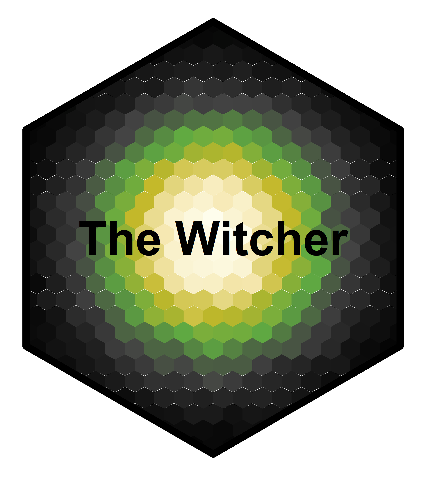

<!-- README.md is generated from README.Rmd. Please edit that file -->

```{r, echo = FALSE}
knitr::opts_chunk$set(
  collapse = TRUE,
  comment = "#>",
  fig.path = "man/figures/README-"
)
```

# theWitcher 


This is a package designed to implement color palettes inspired by the TV Show, book series and video games of The Witcher.

## Installation

```{r, eval=FALSE}
# install.packages("devtools")
devtools::install_github("graflukas138/thewitcher")
```

## Palettes
`theWitcher` provides 30 different palettes.An overview can be had with the `witcher_colors()`
function:

```{r}
library(theWitcher)

witcher_colors()
```


## ggplot2 support
`theWitcher` provides relevant scales for use with `ggplot2`. It only suggests 
`ggplot2` in order to stay lightweight, but if `ggplot2` is available you'll 
have access to the `scale_[colour|fill]_witcher()` functions:

```{r, message=FALSE}

library(ggplot2)
ggplot(data.frame(x = rnorm(10000), y = rnorm(10000)), aes(x = x, y = y)) +
  geom_hex() + coord_fixed() +
  scale_fill_witcher(option="Geralt") + theme_bw()


```

```{r, message=FALSE}
ggplot(data.frame(x = rnorm(10000), y = rnorm(10000)), aes(x = x, y = y)) +
  geom_hex() + coord_fixed() +
  scale_fill_witcher(option="Ciri") + theme_bw()
```


```{r, message=FALSE}
ggplot(data.frame(x = rnorm(10000), y = rnorm(10000)), aes(x = x, y = y)) +
  geom_hex() + coord_fixed() +
  scale_fill_witcher(option="Yennefer") + theme_bw()
```


```{r, message=FALSE}
ggplot(data.frame(x = rnorm(10000), y = rnorm(10000)), aes(x = x, y = y)) +
  geom_hex() + coord_fixed() +
  scale_fill_witcher(option="Emhyr") + theme_bw()
```

