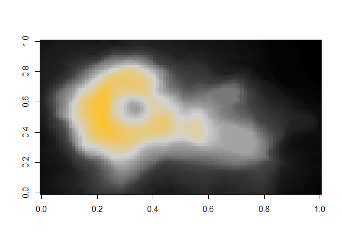
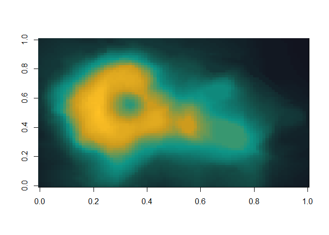
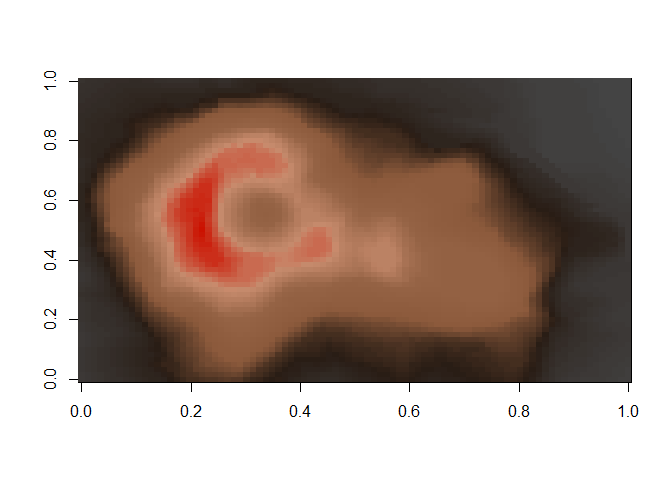

<!-- README.md is generated from README.Rmd. Please edit that file -->

# theWitcher 

This is a package designed to implement color palettes inspired by the
TV Show, book series and video games of The Witcher.

## Installation

``` r
# install.packages("devtools")
devtools::install_github("graflukas138/thewitcher")
```

## Palettes

`theWitcher` provides 30 different palettes. An overview can be viewed
with the `witcher_colors()` function:

``` r
library(theWitcher)

witcher_colors()
```

<!-- -->

# Usage

An example of usage for the `theWitcher` - color scales. The default
option is Geralt.

``` r
pal <- witcher(255, option = "Geralt")
image(volcano, col = pal)
```

<!-- -->

How about a plot that is inspired by a Witcher school?

``` r
pal <- witcher(255, option = "school_griffin")
image(volcano, col = pal)
```

<!-- -->

Or a monster?

``` r
pal <- witcher(255, option = "necrophage")
image(volcano, col = pal)
```

<!-- -->

Or a witcher sign?

``` r
pal <- witcher(255, option = "axi")
image(volcano, col = pal)
```

<!-- -->

## ggplot2

`theWitcher` provides color scales for use with `ggplot2`. If `ggplot2`
is available you’ll have access to the `scale_[colour|fill]_witcher()`
functions:

``` r
library(ggplot2)
ggplot(data.frame(x = rnorm(10000), y = rnorm(10000)), aes(x = x, y = y)) +
  geom_hex() + coord_fixed() +
  scale_fill_witcher(option="Geralt") + theme_bw()
```

<!-- -->

``` r
ggplot(data.frame(x = rnorm(10000), y = rnorm(10000)), aes(x = x, y = y)) +
  geom_hex() + coord_fixed() +
  scale_fill_witcher(option="Ciri") + theme_bw()
```

<!-- -->

``` r
ggplot(data.frame(x = rnorm(10000), y = rnorm(10000)), aes(x = x, y = y)) +
  geom_hex() + coord_fixed() +
  scale_fill_witcher(option="wildhunt") + theme_bw()
```

<!-- -->

``` r
ggplot(data.frame(x = rnorm(10000), y = rnorm(10000)), aes(x = x, y = y)) +
  geom_hex() + coord_fixed() +
  scale_fill_witcher(option="leshen") + theme_bw()
```

<!-- -->
