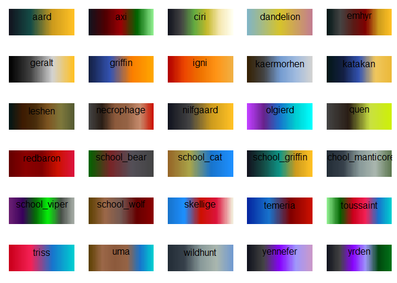

<!-- README.md is generated from README.Rmd. Please edit that file -->

# theWitcher 

This is a package designed to implement color palettes inspired by the
TV Show, book series and video games of The Witcher.

## Installation

``` r
# install.packages("devtools")
devtools::install_github("graflukas138/thewitcher")
```

## Palettes

`theWitcher` provides 30 different palettes.An overview can be had with
the `witcher_colors()` function:

``` r
library(theWitcher)

witcher_colors()
```

<!-- -->

## ggplot2 support

`theWitcher` provides relevant scales for use with `ggplot2`. It only
suggests `ggplot2` in order to stay lightweight, but if `ggplot2` is
available you’ll have access to the `scale_[colour|fill]_witcher()`
functions:

``` r
library(ggplot2)
ggplot(data.frame(x = rnorm(10000), y = rnorm(10000)), aes(x = x, y = y)) +
  geom_hex() + coord_fixed() +
  scale_fill_witcher(option="Geralt") + theme_bw()
```

<!-- -->

``` r
ggplot(data.frame(x = rnorm(10000), y = rnorm(10000)), aes(x = x, y = y)) +
  geom_hex() + coord_fixed() +
  scale_fill_witcher(option="Ciri") + theme_bw()
```

<!-- -->

``` r
ggplot(data.frame(x = rnorm(10000), y = rnorm(10000)), aes(x = x, y = y)) +
  geom_hex() + coord_fixed() +
  scale_fill_witcher(option="Yennefer") + theme_bw()
```

<!-- -->

``` r
ggplot(data.frame(x = rnorm(10000), y = rnorm(10000)), aes(x = x, y = y)) +
  geom_hex() + coord_fixed() +
  scale_fill_witcher(option="Emhyr") + theme_bw()
```

<!-- -->
