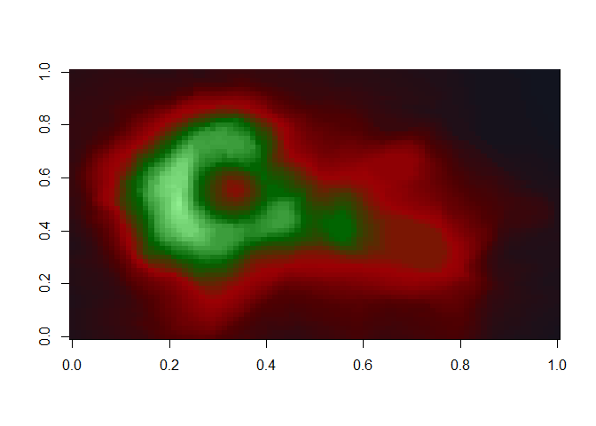
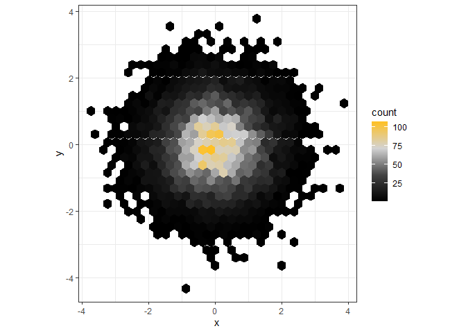
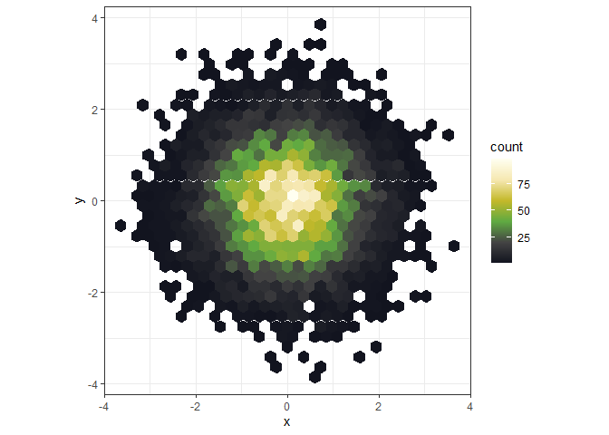
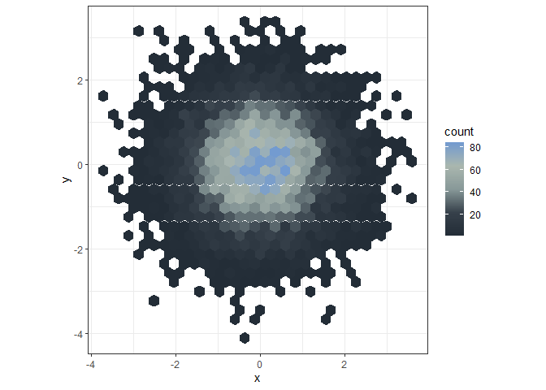

<!-- README.md is generated from README.Rmd. Please edit that file -->

# thewitcher 

<!-- badges: start -->

[](https://cran.r-project.org/package=thewitcher)
[](https://github.com/r-hub/cranlogs.app)
[](https://github.com/r-hub/cranlogs.app)
<!-- badges: end -->

This is a package designed to implement color palettes inspired by the
TV Show, book series and video games *The Witcher* into `R` and
`ggplot2`.  
The package draws some inspiration from the `gameofthrones`-package.  
Most color palettes are inspired by the 3rd installation of the video
games: *The Witcher III - Wild Hunt*

For questions or suggestions please contact me:

Email: <graflukas57@gmail.com>


Twitter: <https://twitter.com/graf_gruen>


## Installation

From Github:

``` r
# install.packages("devtools")
devtools::install_github("graflukas138/thewitcher")
```

From CRAN:

``` r
install.packages("thewitcher")
```

## Palettes

`thewitcher` provides 30 different palettes. An overview can be viewed
with the `witcher_colors()` function:

``` r
library(thewitcher)

witcher_colors()
```

<!-- -->

# Usage

An example of usage for the `thewitcher` - color scales. The default
option is Geralt.

``` r
pal <- witcher(255, option = "Geralt")
image(volcano, col = pal)
```

<!-- -->

How about a plot that is inspired by a Witcher school?

``` r
pal <- witcher(255, option = "school_griffin")
image(volcano, col = pal)
```

<!-- -->

Or a monster?

``` r
pal <- witcher(255, option = "necrophage")
image(volcano, col = pal)
```

<!-- -->

Or a witcher sign?

``` r
pal <- witcher(255, option = "axi")
image(volcano, col = pal)
```

<!-- -->

## ggplot2

`thewitcher` provides color scales and functions to use with
`ggplot2`.  
If `ggplot2` is available you’ll have access to the
`scale_[colour|fill]_witcher()` functions:

### Continous data

``` r
ggplot(data.frame(x = rnorm(10000), y = rnorm(10000)), aes(x = x, y = y)) +
  geom_hex() + coord_fixed() +
  scale_fill_witcher(option="Geralt") + theme_bw()
```

<!-- -->

``` r
ggplot(data.frame(x = rnorm(10000), y = rnorm(10000)), aes(x = x, y = y)) +
  geom_hex() + coord_fixed() +
  scale_fill_witcher(option="Ciri") + theme_bw()
```

<!-- -->

``` r
ggplot(data.frame(x = rnorm(10000), y = rnorm(10000)), aes(x = x, y = y)) +
  geom_hex() + coord_fixed() +
  scale_fill_witcher(option="wildhunt") + theme_bw()
```

<!-- -->

``` r
ggplot(data.frame(x = rnorm(10000), y = rnorm(10000)), aes(x = x, y = y)) +
  geom_hex() + coord_fixed() +
  scale_fill_witcher(option="leshen") + theme_bw()
```

<!-- -->

### Discrete data

Use `scale_fill_witcher_d()` to plot discrete data.

``` r
txsamp <- subset(txhousing, city %in%
  c("Houston", "Fort Worth", "San Antonio", "Dallas", "Austin"))

ggplot(txsamp, aes(x = median, fill = city)) +
  geom_histogram(position = "dodge", binwidth = 15000)+ scale_fill_witcher_d(option = "katakan")+ theme_bw()
```

<!-- -->

Order of colors can be reversed using `direction = -1`.

``` r
txsamp <- subset(txhousing, city %in%
  c("Houston", "Fort Worth", "San Antonio", "Dallas", "Austin"))

ggplot(txsamp, aes(x = median, fill = city)) +
  geom_histogram(position = "dodge", binwidth = 15000)+ scale_fill_witcher_d(option = "katakan", direction = -1) + theme_bw()
```

<!-- -->

*“Evil is evil. Lesser, greater, middling… Makes no difference. The
degree is arbitrary. The definition’s blurred. If I’m to choose between
one evil and another… I’d rather not choose at all.”* - Geralt of Rivia
